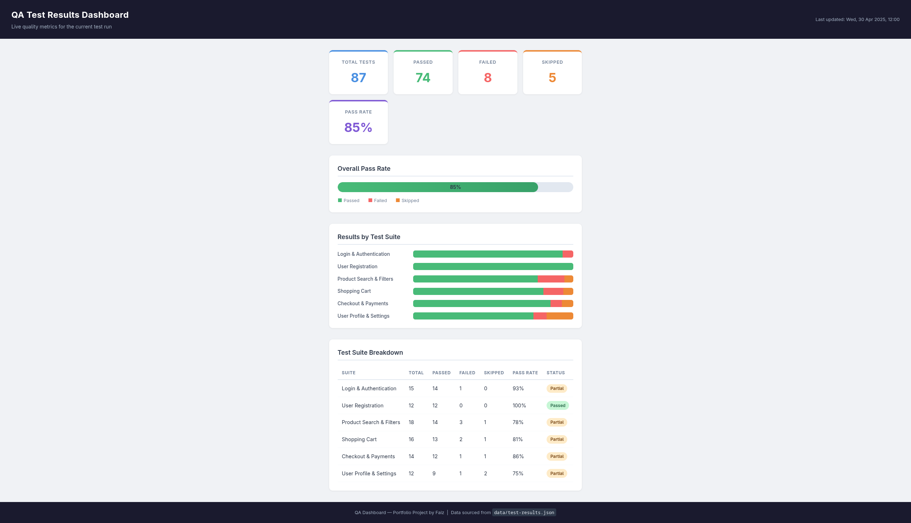

# QA Test Results Dashboard

A lightweight, interactive dashboard that visualises automated test results and quality metrics — built with plain HTML, CSS, and JavaScript. No frameworks, no build tools.

---

## Live Preview




> Open `index.html` via a local web server (see [Running Locally](#running-locally) below).


---

## What This Project Demonstrates

This project showcases the QA skills that matter to engineering teams:

| Skill | Where it appears |
|-------|-----------------|
| **Data-driven thinking** | Dashboard reads from a structured JSON data source, mirroring how real test runners export results |
| **Quality metrics literacy** | Pass rate, failure breakdown, and suite-level status — the numbers teams use to make release decisions |
| **Clear communication** | Recruiter-friendly docs explaining what each metric means and why it matters |
| **CI/CD integration** | GitHub Actions workflow validates the project on every push |
| **Attention to accessibility** | ARIA roles on the progress bar; semantic HTML throughout |
| **Cross-browser compatibility** | Pure HTML/CSS/JS — no framework dependencies |

---

## Project Structure

```
qa-dashboard-project/
├── index.html              # Dashboard layout
├── styles.css              # All visual styles
├── dashboard.js            # Data fetching and DOM rendering logic
├── data/
│   └── test-results.json   # Test result data source
├── docs/
│   ├── qa-metrics-explained.md    # Plain-English guide to each metric
│   └── sample-test-summary.md     # Example test summary report
└── .github/
    └── workflows/
        └── validate.yml    # CI: validates files and JSON on every push
```

---

## Dashboard Features

### Summary Cards
Five at-a-glance cards: **Total**, **Passed**, **Failed**, **Skipped**, and **Pass Rate**. Each card uses a colour accent that matches its semantic meaning (green = pass, red = fail, orange = skip).

### Pass Rate Progress Bar
A colour-coded bar showing the overall pass rate. The bar turns red when the pass rate drops below 70%, signalling a release risk.

### Stacked Bar Chart
Each test suite gets a horizontal bar showing its pass/fail/skip breakdown, making it easy to spot which area has the most failures.

### Test Suite Table
A detailed table listing every suite with its individual counts, pass rate, and a status badge (`passed`, `partial`, or `failed`).

---

## Data Source

All metrics are loaded from `data/test-results.json`. To update the dashboard with real results, replace the values in that file. The structure is:

```json
{
  "lastUpdated": "2025-04-30T10:00:00Z",
  "summary": {
    "total": 87,
    "passed": 74,
    "failed": 8,
    "skipped": 5
  },
  "suites": [
    {
      "name": "Suite Name",
      "total": 15,
      "passed": 14,
      "failed": 1,
      "skipped": 0,
      "status": "partial"
    }
  ]
}
```

`status` can be `"passed"`, `"partial"`, or `"failed"`.

---

## Running Locally

The dashboard fetches the JSON file over HTTP, so it needs a local web server (browsers block `fetch()` on `file://` URLs for security reasons).

**Option 1 — Python (no install required):**
```bash
cd qa-dashboard-project
python3 -m http.server 8080
# Open http://localhost:8080
```

**Option 2 — Node.js `serve`:**
```bash
cd qa-dashboard-project
npx serve .
# Open the URL shown in the terminal
```

**Option 3 — VS Code Live Server extension:**
Right-click `index.html` → *Open with Live Server*

---

## GitHub Actions CI

The workflow in `.github/workflows/validate.yml` runs on every push and pull request. It checks:

1. All required files are present
2. `test-results.json` is valid JSON with correct structure
3. Summary totals (passed + failed + skipped) add up to total
4. `index.html` contains all required element IDs

---

## Documentation

| Document | Purpose |
|----------|---------|
| [`docs/qa-metrics-explained.md`](docs/qa-metrics-explained.md) | Plain-English explanation of each metric and what the numbers mean for release decisions |
| [`docs/sample-test-summary.md`](docs/sample-test-summary.md) | A realistic test run summary report in the format QA teams share with stakeholders |

---

## Related Portfolio Projects

| Project | Focus |
|---------|-------|
| [qa-automation-playwright-portfolio](https://github.com/faiz/qa-automation-playwright-portfolio) | Playwright UI automation, Page Object Model, GitHub Actions CI |
| [api-testing-portfolio](https://github.com/faiz/api-testing-portfolio) | Playwright API testing, full CRUD coverage, positive/negative/edge cases |
| **qa-dashboard-project** (this project) | Test results visualisation, quality metrics, CI validation |

---

## Tech Stack

- **HTML5** — semantic markup
- **CSS3** — custom properties, grid, flexbox, transitions
- **Vanilla JavaScript (ES2020)** — async/await, DOM manipulation
- **JSON** — data interchange format
- **GitHub Actions** — CI validation

---

*Built as part of a QA Engineering portfolio. Contact: eezydoes@hotmail.com*
